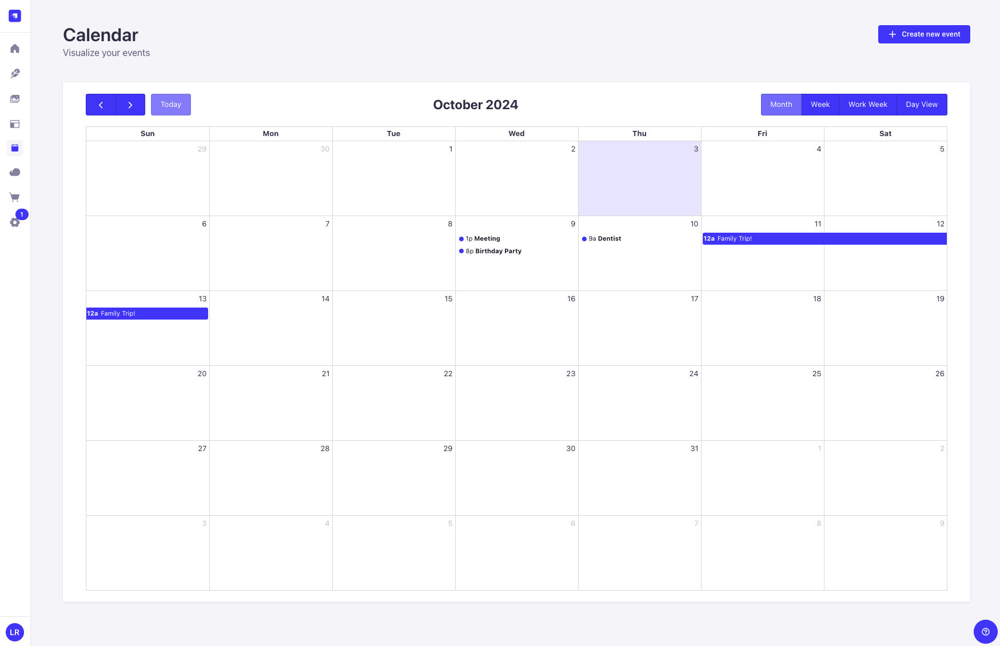
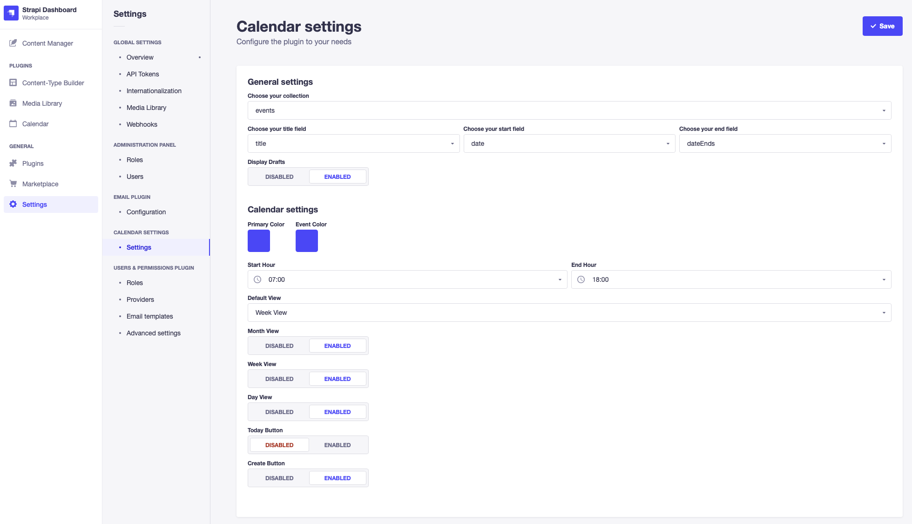

<p align="center">
  
</p>
<h1 align="center">Strapi Plugin Calendar</h1>
<p align="center">
  <a href="https://badge.fury.io/js/@offset-dev%2Fstrapi-calendar" target="_blank">
    
  </a>
  <a href="https://github.com/offset-dev/strapi-calendar/actions/workflows/publish.yml" target="_blank">
    
  </a>
  <a href="https://github.com/offset-dev/strapi-calendar/actions/workflows/lint.yml" target="_blank">
    
  </a>

> Visualize your content in a map with month, weekly and daily view.
> [View on Strapi Marketplace](https://market.strapi.io/plugins/@offset-dev-strapi-calendar)



</p>

## V1 Features

- New Calendar Library (Now using [FullCalendar](https://fullcalendar.io))
- New Reset Settings endpoint (/strapi-calendar/clear-settings)
- Fully compatible with Strapi 5
- Now using Document Service API
- Now using Strapi Plugin SDK
- Typescript ♥️
- Eslint & Prettier Config

## Demo

[](https://www.loom.com/share/53e30106697044fdb365490a8b48df25)

## How to Install

Copy the following code and run from your terminal

```
npm i @offset-dev/strapi-calendar
```

## How to Use

Open the settings page and select the calendar settings.



Here you can select which collection and fields to use.
You can also customize the calendar style and options.

## Coffee Support

Absolutely no pressure, but if you found this plugin helpful and want to buy me a coffee, you can do it [here](https://donate.stripe.com/9AQcPq8MnerG39C8wx)


